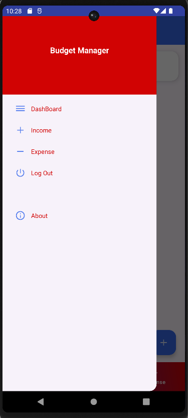

# Budget Manager Android App

## Project Overview
This Android application allows users to manage their budget by tracking income and expenses. Users can register, log in, add/edit/delete entries, and monitor their financial activity through a dashboard.

## Features
- User Registration and Login
- Password Reset
- Add/Edit/Delete Income and Expense Entries
- View Summary Dashboard
- Logout Functionality

## Technologies Used
- Java
- Firebase Authentication
- Firebase Realtime Database
- Android Studio

## How to Run the App
1. Open the project in Android Studio.
2. Connect a device or start an emulator.
3. Click "Run" to install and launch the app.

## 📸 App Screenshots

### 📝 Register Screen

### 🔐 Login Screen

### 🔁 Reset Password

### 📊 Dashboard

### ➕ Add Income

### ➖ Add Expense

### 📄 View Entries

### ✏️ Edit Entry

### 🚪 Logout

- ## 📁 Folder Structure
- `app/` - Android source code    
- `.gradle/` - Gradle build system folder  
- `.idea/` - Android Studio settings  
- `gradle/` - Gradle wrapper files  
- `build.gradle.kts` - Project-level build script  
- `settings.gradle.kts` - Gradle settings  
- `gradlew`, `gradlew.bat` - Gradle wrapper scripts  
- `local.properties` - Local SDK path (not for version control)  
- `.gitignore` - Git ignored files list 

  

## Author
MD. TOUFIQ HASAN
Bangladesh Army University of Science and technology, (BAUST), Saidpur
